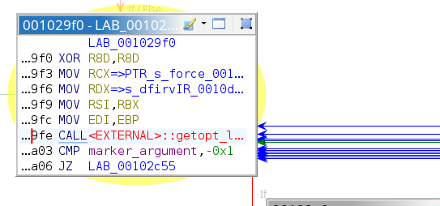
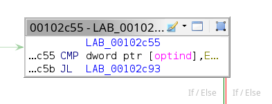
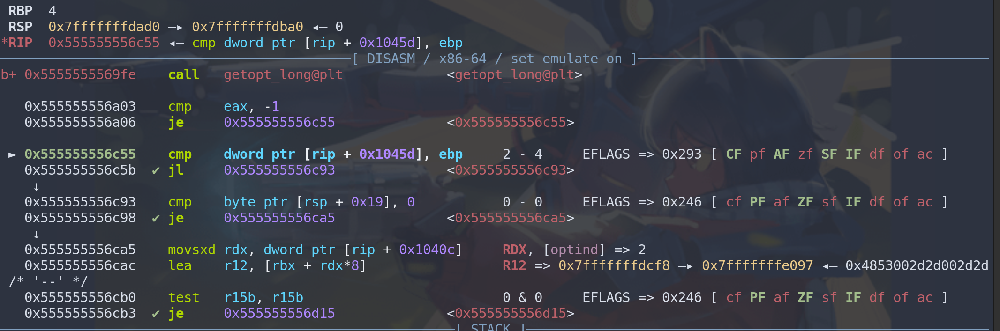
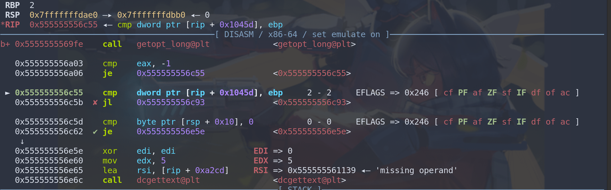
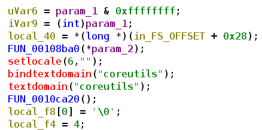
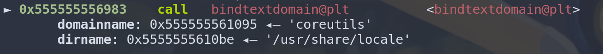
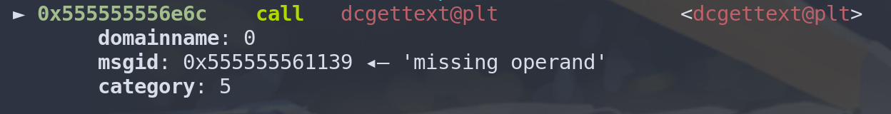

# Reversing and Recreating "rm"

## Reversing rm

sebelum aku membuat program rm (remove) itu sendiri, aku mencoba untuk me reverse program nya terlebih dahulu

untuk mendapatkan berbagai macam fun fact yang bisa ditemukan, seperti bagaimana programmer kelas atas membuat program

### what i got

#### 1. get_opt_long
merupakan API milik standar POSTFIX library yang memiliki fungsi untuk memparsing parameter, berupa:

1. "-"
2. "--"

pada pemanggilan getopt, program mengecek apakah return value nya -1.

Karena pada getopt jika return value nya -1, maka mengartikan bahwa getopt gagal memparsing value di dalam - atau --. bisa disebabkan karena kosong atau disebabkan oleh invalid UTF character

pada branch kedua, program mengecek apakah kita memberikan argument lebih dari 2 ?

jika iya maka, parameter kosong kita yaitu "-- " atau "- ", akan dianggap bukan sebagai operand parameter. tetapi dianggap untuk menghapus file, jadi error missing operand akan gagal

ketika aku "rm -- -- -- --"

dan

ketika aku "rm --"

#### 2. setlocale, bindtextdomain, textdomain, dcgettext

merupakan fungsi fungsi yang membantu program menguniversalkan bahasa, melalui locale pada system.

system nya bukan auto translasi, melainkan lookup table, jadi jika bahasa yang kita cari menggunakan dcgettext tidak ada pada coreutils.mo

maka program akan tetap menampilkan text asli dari developer

"char *setlocale(int category, const char *locale);"

category 6 merupakan LC_ALL, maka semua kategori teks akan di sentralisasi, dan jika locale berisi NULL maka kita akan menggunakan local locale

kemudia program memanggil bindtextdomain()

"char * bindtextdomain (const char * domainname, const char * dirname);
"

"Message  catalogs  will be expected at the pathnames dirname/locale/category/domainname.mo, where locale is a locale
       name and category is a locale facet such as LC_MESSAGES.
"

bindtextdomain berfungsi set path dimana lookup table berada(param2), dan apa nama lookup table nya (param1)

char * textdomain (const char * domainname);

berfungsi untuk set default lookuptable mana yang kita gunakan, jadi ketika dcgettext dipanggil dan param1 (domain) di set NULL maka dcgettext akan menggunakan default yang sudah kita set

"char * dcgettext (const char * domainname, const char * msgid,
                         int category);"

domainname, domain apa yang ingin dipakai

msgid, text yang ingin kita translate

category, LC_XXX apa yang ingin kita cari di lookuptable

RETURN VALUE
       If  a  translation was found in one of the specified catalogs, it is converted to the locale's codeset and returned.
       The resulting string is statically allocated and must not be modified or freed. Otherwise msgid is returned.

#### 3. ingin lanjut handler remove sebelum unlink, tetapi nanti aja

## Recreating rm

karena program rm yang ingin aku buat tidak ingin aku release, maka i dont give a fuck tentang bindtext, setlocale, dll

aku akan fokus kepada unlink saja